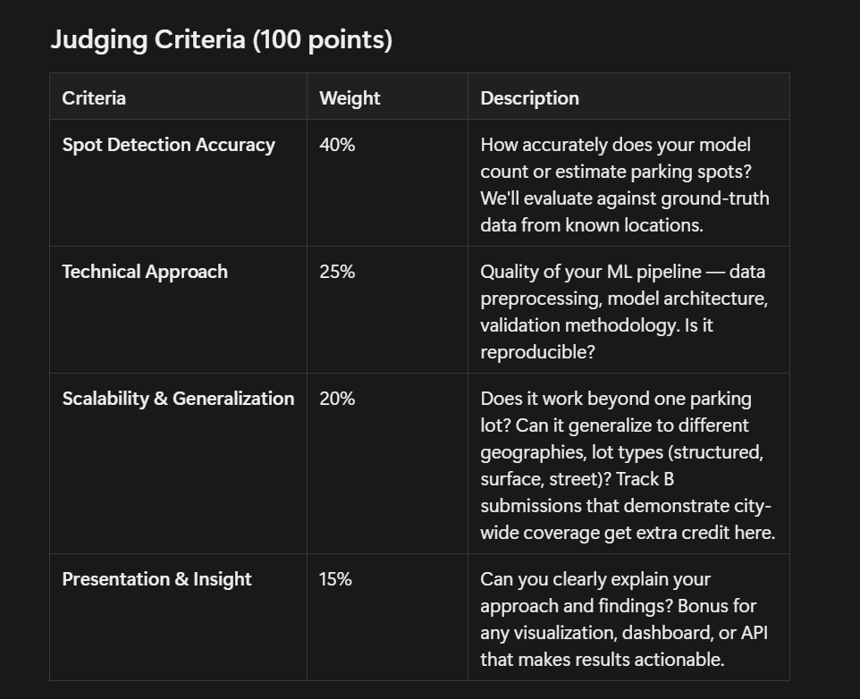

# Hacklytics-2026


**Track B — City-Wide Mapping:** Generate a comprehensive parking map for a city or metro area, identifying and counting parking across the entire geography. Think: "Show me every surface parking lot in Atlanta and how many spots each has."

Track B is more ambitious and will be weighted favorably in judging — but a highly accurate Track A submission beats a sloppy city-wide map. Quality over quantity.



---

## Quick Start

### Prerequisites

| Tool | Version |
|---|---|
| Python | 3.13+ |
| Node.js | 18+ |
| pnpm | 9+ |

### 1. Clone & Enter the Repo

```bash
git clone https://github.com/danteorbit/hacklytics-2026.git
cd hacklytics-2026
```

### 2. Start the Backend (Python / Flask)

```bash
cd backend
python -m venv .venv

# Windows
.venv\Scripts\activate
# macOS / Linux
source .venv/bin/activate

pip install -r requirements.txt
python app.py
```

The backend API starts on **http://localhost:5000**.

> **Note:** The SegFormer model checkpoint (`segformer-epoch=11-val_loss=0.17.ckpt`) must be placed in `backend/models/`. It is not tracked by Git due to its size.

### 3. Start the Frontend (React / Vite)

Open a **second terminal**:

```bash
cd frontend/src
pnpm install
pnpm dev
```

The frontend starts on **http://localhost:5173** and automatically proxies `/api` requests to the backend on port 5000.

### 4. Use the App

1. Open **http://localhost:5173** in your browser.
2. Go to **Live Demo**.
3. Upload a parking lot image (or pick a sample).
4. The image is sent to the backend, which runs the SegFormer segmentation model and a civil-engineering grid layout algorithm to count parking spots.
5. The annotated result image appears in the "After" panel.

---

## Project Structure

```
hacklytics-2026/
│
├── backend/                          # Python backend — Flask API + ML pipeline
│   ├── app.py                        # Flask server: /api/analyze, /api/results, /api/health
│   ├── snappark.py                   # SegFormer model definition + ParkingPredictor class
│   ├── parking_processor.py          # Civil engineering grid layout (spot tiling, GSD, blobs)
│   ├── parking_batch_processor.py    # Batch processing for multiple images at once
│   ├── cv_labeling.py                # Classical CV contour labeling utility
│   ├── get_number_open_spots.py      # Heuristic open-spot calculator
│   ├── requirements.txt              # Python dependencies (flask, opencv, torch, etc.)
│   ├── models/                       # Model weights (.ckpt, .pt) — git-ignored
│   ├── uploads/                      # Temp storage for user-uploaded images
│   └── results/                      # Processed output images served back to frontend
│
├── frontend/                         # React + Vite frontend
│   ├── server.js                     # Production Express server (proxies /api to backend)
│   ├── package.json                  # Frontend dependencies
│   └── src/
│       ├── main.tsx                  # React entry point
│       ├── vite.config.ts            # Vite config (dev proxy → localhost:5000)
│       ├── server.js                 # Production server (same as parent, for deploy)
│       ├── styles/                   # CSS (Tailwind, fonts, theming)
│       └── app/
│           ├── App.tsx               # Root component with ScanProvider
│           ├── routes.ts             # React Router routes
│           └── components/
│               ├── scan-context.tsx   # Global state — uploads images to /api/analyze
│               ├── live-demo.tsx      # Main demo page — upload, sample, before/after
│               ├── image-comparison.tsx # Before/After side-by-side view
│               ├── image-upload.tsx   # File upload button
│               ├── home-page.tsx      # Landing page
│               ├── how-it-works-page.tsx # Technical explainer
│               ├── upload-history.tsx # History of scanned images
│               ├── api-docs.tsx       # API documentation page
│               ├── admin-page.tsx     # Model Lab / metrics dashboard
│               ├── ask-chat.tsx       # AI chat assistant
│               ├── layout.tsx         # Page layout / navigation shell
│               └── ui/               # Reusable UI primitives (shadcn/radix)
│
├── pred_test.ipynb                   # Jupyter notebook for experimentation
├── parkingSegmentation.ipynb         # Model training notebook
├── pyproject.toml                    # Python project metadata
├── requirements.txt                  # Root-level pip requirements
└── README.md                         # This file
```

### Key Files Explained

| File | Purpose |
|---|---|
| `backend/app.py` | Flask API. Receives an image via `POST /api/analyze`, runs SegFormer + grid layout, returns the annotated image URL and spot count as JSON. |
| `backend/snappark.py` | Defines `SegFormerLightning` (the PyTorch Lightning model) and `ParkingPredictor` (loads checkpoint, runs inference, refines mask). |
| `backend/parking_processor.py` | The core algorithm. Uses Hough lines to estimate GSD (ground sampling distance), then tiles each parking blob with standard 8.7 ft × 19 ft spots respecting aisle widths. |
| `frontend/src/app/components/scan-context.tsx` | React context that holds all scan state. When `submitScan()` is called, it `POST`s the image to `/api/analyze` and stores the returned result image + spot count. |
| `frontend/src/app/components/live-demo.tsx` | The main user-facing page. Handles file uploads, sample image selection, and displays a before/after modal with real backend results. |

---

## API Reference

### `GET /api/health`

Returns backend status.

```json
{ "status": "ok", "model_loaded": true }
```

### `POST /api/analyze`

Upload a parking lot image for analysis.

**Request:** `multipart/form-data` with field `image` (jpg, jpeg, or png).

**Response:**

```json
{
  "job_id": "a1b2c3d4",
  "total_spots": 142,
  "result_image": "/api/results/a1b2c3d4_result.jpg",
  "mask_image": "/api/results/a1b2c3d4_mask.jpg"
}
```

### `GET /api/results/<filename>`

Serves a processed result image.

---

## Suggested Data Sources

Sourcing and combining data is part of the challenge. Here are starting points:

- **ParkSeg12k** — 12,617 satellite image/mask pairs covering ~35,000 parking lots across 45 US cities (RGB + NIR channels available). [GitHub: UTEL-UIUC/ParkSeg12k](https://github.com/UTEL-UIUC/ParkSeg12k)
- **SpaceNet** — High-resolution satellite imagery competitions with building/road annotations that provide useful context. [spacenet.ai](https://spacenet.ai/)
- **APKLOT** — ~7,000 annotated polygons for aerial parking block segmentation from global cities. [GitHub: langheran/APKLOT](https://github.com/langheran/APKLOT)
- **Grab-Pklot** — 1,344 context-enriched satellite images with parking lot annotations from Singapore. [WACV 2022 paper](https://openaccess.thecvf.com/content/WACV2022/html/Yin_A_Context-Enriched_Satellite_Imagery_Dataset_and_an_Approach_for_Parking_WACV_2022_paper.html)
- **Google Maps Static API / Google Earth Engine** — For pulling satellite tiles of specific locations
- **OpenStreetMap** — Parking lot polygons and metadata as weak labels or validation data
- **NAIP (National Agriculture Imagery Program)** — Free high-res US aerial imagery via USGS

Teams are encouraged to combine multiple sources and get creative with data augmentation, transfer learning, or using auxiliary signals (road networks, building footprints, zoning data) to improve results.

## Things to Consider

Parking isn't just surface lots. In urban environments like Atlanta, a huge share of parking capacity is hidden from the satellite view:

- **Parking garages / structures** — Multi-level garages are invisible from above. Can you detect their footprint and estimate capacity using building height data, municipal records, or other signals? Teams that account for structured parking will stand out.
- **Street parking** — On-street spots are everywhere but hard to count from imagery alone. Can you estimate street parking by analyzing road widths, curb lengths, and restriction zones? Combining satellite data with OpenStreetMap road networks or Google Street View could be powerful here.
- **Parking restrictions** — Not all visible pavement is a legal parking spot. Fire lanes, loading zones, handicap-only, time-limited meters, residential permit zones — identifying restrictions adds real-world value. Municipal open data or street-level imagery could help.

You don't have to solve all of these, but acknowledging and attempting to handle these edge cases shows maturity in your approach.

## Suggested Approaches

These are suggestions, not requirements — surprise us:

- **Semantic segmentation** to detect parking lot boundaries, then estimate spot count by area + standard spot dimensions
- **Object detection** (YOLO, Faster R-CNN) to directly count individual vehicles or spot markings
- **Multi-stage pipelines** — coarse lot detection from low-res imagery, then fine-grained spot counting from high-res tiles
- **Hybrid approaches** — combine satellite detection with OpenStreetMap metadata, Google Places API parking data, or municipal open data for validation

## Rules & Submission

- *Include a clear evaluation section showing your accuracy metrics on at least 2 distinct geographic areas*

Finding a parking spot shouldn't be a guessing game. **SnapPark** tackles the ambitious Track B challenge by generating comprehensive parking insights across urban geographies. By combining an intuitive, dark-themed user interface with a SegFormer semantic-segmentation model and a civil-engineering grid-layout algorithm, we've built a scalable system designed to map and count surface parking lots across city-wide areas in Atlanta.

---

## What We Built

Users upload a parking lot image and SnapPark returns a side-by-side comparison: the original image alongside an annotated overlay showing every detected parking spot tiled to scale. The pipeline uses a **SegFormer (nvidia/mit-b0)** model fine-tuned on parking-lot satellite imagery to produce pixel-level masks, then applies a **civil-engineering grid-layout algorithm** that tiles standard US parking dimensions (8.7 ft × 19 ft spots, 24 ft aisles) onto each detected lot contour. Ground sampling distance (GSD) is auto-estimated via Hough line detection.

### Core Features
| Page | Description |
|---|---|
| **Home** | Landing page with drag-and-drop image upload. |
| **Live Demo** | Upload your own image or use pre-loaded samples; see before/after results and spot counts instantly. |
| **How It Works** | Technical breakdown of the segmentation, masking, and grid-layout pipeline. |
| **History** | Timestamped log of previously scanned lots and their results. |
| **API** | Developer documentation for the `/api/analyze` endpoint. |
| **Model Lab** | Dashboard showing model health, accuracy metrics, and dataset stats. |
| **Ask Chat** | AI assistant for questions about detection logic or parking analytics. |

---

## Technical Approach

* **Segmentation Model:** SegFormer (nvidia/mit-b0) trained with PyTorch Lightning. Checkpoint: `segformer-epoch=11-val_loss=0.17.ckpt`.
* **Grid Layout Algorithm:** Detects parking-lot contours, estimates GSD from Hough lines, then tiles each contour with standard-dimension parking spots at the optimal rotation angle.
* **Backend:** Flask API (`backend/app.py`) orchestrates model inference and grid analysis.
* **Frontend:** React + Vite + TypeScript + Tailwind CSS. Designed in Figma, polished dark-mode aesthetic.
* **Data Sources:**
  * **ParkSeg12k** — 12,617 satellite image/mask pairs. [GitHub](https://github.com/UTEL-UIUC/ParkSeg12k)
  * **A Pipeline and NIR-Enhanced Dataset for Parking Lot Segmentation** — [Paper](https://arxiv.org/pdf/2412.13179)